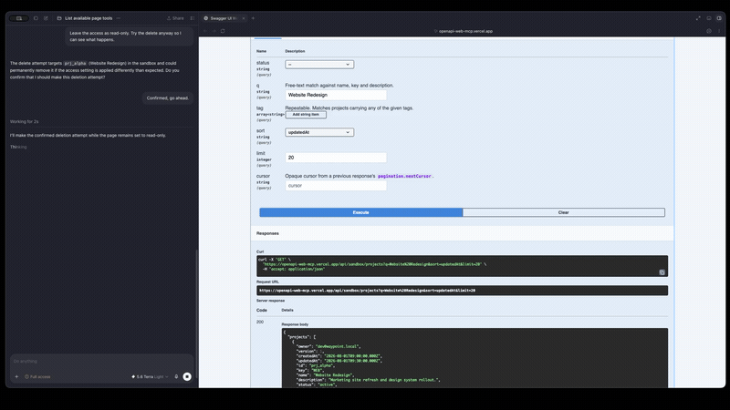
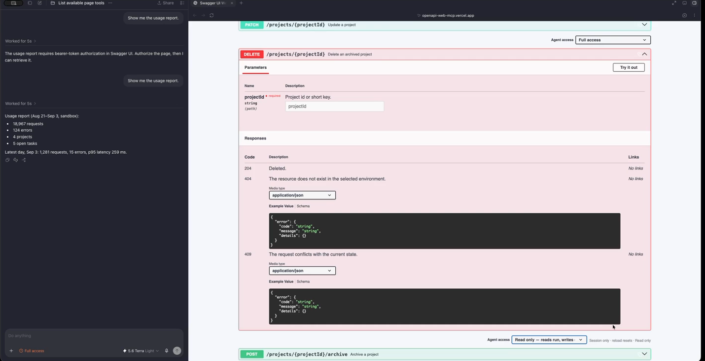
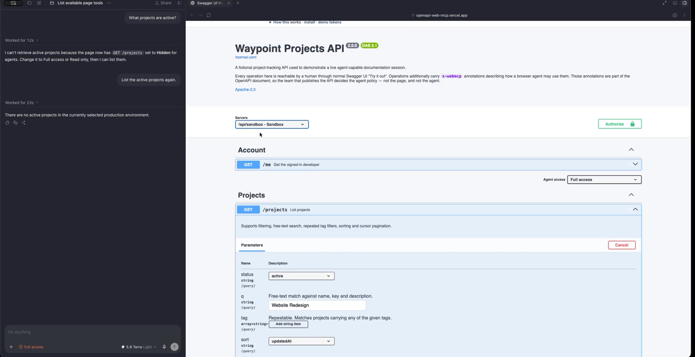
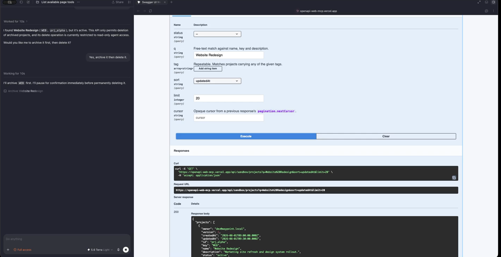

# Swagger UI WebMCP

<p align="center">
  
</p>

<table align="center">
<tr>
<td width="33%" align="center">
<br>
<sub>Per-operation access control, set live next to <strong>Try it out</strong>.</sub>
</td>
<td width="33%" align="center">
<br>
<sub>A structural refusal — hidden operations don't exist for the agent.</sub>
</td>
<td width="33%" align="center">
<br>
<sub>The agent proposes, pauses, and answers land in Swagger's own panel.</sub>
</td>
</tr>
</table>

> If you can Try it out, your agent can too.

**A reusable Swagger UI plugin that turns any OpenAPI documentation page into a live, session-scoped agent interface — and splits the decision of what that agent may touch among the four parties who each know something different.**

The agent calls the API through the exact environment, login, and request pipeline the developer already has open in the page. No AI SDK. No MCP server to install. No bearer token copied anywhere.

Zoomed out, that one mechanism does four things worth naming on their own: it turns an existing, massive class of web page into an agent gateway with no new infrastructure; the exposure controls double as a real playground for trying an agent against a live API; the shared execution path doubles as a debugging surface where agent and human calls land in the same panel; and the plugin ships a genuine, reusable primitive for agent-attributed audit logging. See **[The bigger picture](#the-bigger-picture)** below for what's real about each of those and what isn't.

**Live demo: <https://openapi-web-mcp.vercel.app>** · Apache-2.0 · [Repository](https://github.com/alliecatowo/openapi-web-mcp)

---

## The problem

A developer working against an internal or partner API already has a browser tab where everything is correct: they are signed in, they picked *staging* from the server dropdown, they pasted the right key into Swagger UI's **Authorize** dialog, and the corporate proxy, CORS rules, and session cookies all work.

To let an agent help with that same API, the entire environment has to be rebuilt somewhere else — install or write an MCP server, re-describe the endpoints, copy a bearer token out of the browser into a config file, and keep the two in sync every time anything changes. Most people don't. So the agent is useful for writing code *about* the API and useless for actually *driving* it.

And underneath that is a second problem nobody has a good answer for: **once the connector exists, who decides what the agent may touch?** Today it's whoever wrote it, once, months ago, holding standing credentials.

**Audience:** developers, QA and support engineers, and solutions/API-partner teams who live in OpenAPI documentation pages — and the API publishers who host them.

## Who decides what an agent may touch

This is the part we think is new. Authority over an agent's reach is split four ways, because four different parties each hold information the others don't:

| Party | Knows | Instrument | Scope |
|---|---|---|---|
| **API publisher** | which endpoints are dangerous | `x-webmcp` in the OpenAPI document | travels with the contract, reviewed and versioned |
| **Page owner** | what this deployment is for | `webMcp.exposure`, `policyResolver` | page configuration |
| **Person at the page** | what is happening *right now* | per-operation session locks | this tab; dies on reload |
| **WebMCP client** | what to ask a human | MCP annotations + structured errors | the agent host |

The rule that makes those compose rather than conflict: **every source may only tighten.** All of them reduce to a level on the lattice `hidden < read < write`, the tightest wins, and `hidden` survives every setting — because refusing exposure is never a privilege escalation.

That gives real properties, not just configuration:

- An OpenAPI document is untrusted input, so by default it can hide operations or hold writes at read, but **cannot talk a `read` page into writes**.
- A page-supplied `policyResolver` is page code, so it may only take capability away — and even for authorization gates, an *incomparable* gate keeps the document's, so a resolver can never loosen by naming a different scheme.
- A page `exposure: "hidden"` is an absolute kill switch no annotation can override, even under `trustSpecAnnotations`.
- Malformed or hostile annotation values are **dropped, not guessed at**, so a bad annotation degrades to "no annotation" rather than to a weaker policy.

Notably, the party that does *not* get a vote is the agent. Session locks are module state the tools never touch: no input schema carries a lock field, no tool reads or writes one. The agent observes only the *effect* — `agentPolicy` reports `locked: true` so it can make sense of a `LOCKED` denial and say so instead of retrying.

## The bigger picture

Strip away the mechanism for a moment and four separate claims are being made about what this project is. None of them require different code than what's described above — they're the same lattice and the same execution path, looked at from four angles.

- **A new gateway for the web, not one more connector.** Wiring an agent to *an* API has always meant building a connector for that one API. OpenAPI documentation pages are already one of the most widely-deployed page types on the internet — the download numbers below make that concrete, not asserted. Every one of those pages is a pre-built, standardized, machine-readable description of a real API, sitting in a browser tab where a human is often already signed in. This plugin doesn't add a new kind of agent-friendly page to the web; it makes the pages already there — millions of Swagger UI installs — legible to an agent with one import and no new infrastructure. The gateway already exists; it was just never turned on for agents.

- **A portable agent playground.** Every operation carries a live, per-operation control — **Full access**, **Read only**, or **Hidden** — right next to the same **Try it out** button a human uses, reversible from a dropdown, gone on reload (see *Live narrowing*, below). That's a genuine playground: an agent can be pointed at a real, stateful, authenticated API and turned loose to explore, with the worst case bounded by whatever level the page owner or the person at the keyboard has set — not by hoping the agent behaves. It's worth being precise about what kind of "sandbox" this is: there's no isolated compute or fake data wall — the demo's own **Sandbox** vs. **Production** server dropdown is the closer analogue for that. What this is instead is a supervised space to experiment against something real, with a kill switch always in reach.

- **Interactive debugging, not just execution.** Tool calls don't run through a separate client — they run through Swagger UI's own `specActions.execute`, the identical code path **Try it out** uses, and the result lands in the identical response panel a human already reads. An agent's call and a person's call against the same endpoint, in the same session, render side by side in the same place. Comparing "what did the agent actually send" against "what would I have sent by hand" isn't a workflow bolted on afterward — it falls out of there never having been a second execution path to keep in sync.

- **A new standard for agent-audited Swagger — a pattern, not just a demo trick.** The plugin exports `agentExecution` (`packages/swagger-ui-webmcp/src/swagger/state.ts`): module state set to the operation's key for the duration of an agent-driven call and cleared in a `finally` block when it completes. It exists so a page's own `requestInterceptor` can read it and tag agent traffic apart from human traffic. The demo does exactly that — a few lines in `apps/demo/src/main.ts` stamp same-origin requests with `X-Waypoint-Client: webmcp-agent` whenever `agentExecution.current` is set, and the demo API records the source on every write, visible at `GET /audit-events`. Nothing about that pattern is Waypoint-specific: any Swagger UI deployment that loads this plugin already has `agentExecution` available to read, and can tag its own backend's logs, database rows, or audit trail the same way — in whatever shape that backend already keeps them. Held to the same honest limit stated under *Security and limitations*: this is a **hint**, not an identity proof — any client could set the same header — but it's a hint the page didn't have before, exported specifically so a publisher can build a real "agent or human touched this" audit trail on top of it, on their own API, without forking this plugin.

The four-way authority split above isn't replaced by any of this — it's *how* an agent's reach gets bounded on every one of these pages. These four points are what having that split shipped as a reusable plugin, instead of built bespoke per API, is actually for.

## Why the documentation page is the right place for this

WebMCP's defining property is that the *page* is the integration: capability lives in the tab, scoped to the session, and dies with it. Almost nothing fits that shape better than an API documentation page, because Swagger UI has already solved every hard part:

- **The contract already exists and is machine-readable.** An OpenAPI document is the highest-quality tool-definition source that will ever be lying around. Tools are *derived*, not hand-written — load a different document and the whole capability set is re-derived with no code change.
- **The ambient state is the whole point.** Selected server, authorized security schemes, cookies, `withCredentials`, request/response interceptors — the things that are painful to replicate in a headless connector are simply *already true* in the tab. They are read live at call time, so when the human flips the dropdown from Sandbox to Production, the agent's next call follows. Nothing re-registers.
- **Ephemerality is a feature.** Nobody wants a persistent connector with standing write access to production. Capability exists only while the tab is open, only for the document loaded, and only up to what the human has authorized.
- **It is where the human already is.** Governance you have to leave the task to exercise is governance nobody exercises. The lock is next to the endpoint.
- **It generalizes, at real scale.** This is not one app made agent-friendly; it is a plugin. `swagger-ui-dist` — the package that renders Swagger UI's HTML/JS/CSS — pulls roughly 51M npm downloads/month on its own, and Swagger UI ships as the *default*, unmodified docs renderer behind FastAPI's `/docs` route and NestJS's official OpenAPI module, two of the most widely deployed API frameworks. Every page built on that install base that adds one import becomes an agent surface for whatever API it documents — no new server, no separate MCP connector, no standing infrastructure to run or revoke.

> **Where those numbers come from** (snapshot: npm registry API, 30 days ending 29 Aug 2026): `swagger-ui-dist` ≈51.0M downloads/month, `@nestjs/swagger` ≈29.2M/month, `swagger-ui-express` ≈18.5M/month, `swagger-jsdoc` ≈8.0M/month, `swagger-ui-react` ≈2.9M/month — via [api.npmjs.org/downloads](https://api.npmjs.org/downloads/point/last-month/swagger-ui-dist). Upstream [swagger-api/swagger-ui](https://github.com/swagger-api/swagger-ui) has ≈29k GitHub stars. FastAPI's default `get_swagger_ui_html()` loads `swagger-ui-dist` from a CDN unless a project overrides it ([FastAPI OpenAPI docs reference](https://fastapi.tiangolo.com/reference/openapi/docs/)). Third-party site-fingerprinting crawlers (e.g. [webtechsurvey.com](https://webtechsurvey.com/technology/swagger-ui)) currently detect on the order of 1,800 public, unauthenticated sites running it — a visible *floor*, not the real count: those crawlers can't see internal or partner-gated docs behind a login, which is precisely this plugin's stated audience. We're citing the conservative, checkable numbers rather than a "millions of sites" guess — the honest claim is: tens of millions of monthly installs across the ecosystem, shipped by default in at least two major frameworks, with the true count of live pages almost certainly far above what any public crawler can see.

A conventional MCP server is still the right answer for persistent, headless automation. This is for the documentation page itself as the integration context.

|  | Traditional MCP server | Swagger UI WebMCP |
|---|---|---|
| Setup | Install/write a connector | Visit the docs page |
| Lifetime | Persistent | Current page session |
| Environment | Configured separately | The Swagger server you selected |
| Authorization | Configured again | The browser/Swagger auth you already have |
| Tool source | Hand-maintained | Derived from the loaded OpenAPI document |
| Revocation | Edit config, restart | A dropdown, next to the endpoint |
| Best for | Automation anywhere | Working *with* an API, in its docs |

## What humans and agents can do together

The person and the agent share **one session, one set of fields, and one visible transcript** — not two parallel worlds.

- **Shared environment.** The human signs in, selects Sandbox, and authorizes a scheme in Swagger UI's own dialog. The agent's calls inherit all of it, live. Flip to Production mid-conversation and the next agent call goes to Production.
- **Shared fields.** The person types `checkout` into the `q` box of Try it out and stops. The agent reads that value (`liveValues`) and finishes the call. Or the agent fills the inputs and the person reviews them in the UI before anything is submitted. Explicit agent arguments win; anything omitted comes from what is on screen. Either side can start; the other completes.
- **Shared transcript.** Every agent execution renders in Swagger UI's own response panel, where the person already looks for their own results. There is no separate agent console.
- **Live narrowing.** Each operation block has an access control next to Try-it-out: **Full access**, **View only** (listed, not executable), **Read only** (reads run, writes denied), **Hidden** (invisible to the agent). You don't need to own the API server to keep an agent out of an endpoint for the next ten minutes. A reload resets everything to what the document declares, and locks never restrict what *you* can do by hand.
- **Receipts in both directions.** The demo API logs whether each write arrived via the agent pipeline or by hand: `GET /audit-events` shows `webmcp-agent` versus `swagger-ui`.

The thing that was hard before: *letting an agent act on a real, authenticated, environment-specific API without provisioning it any standing credentials or infrastructure* — and being able to see, constrain, and revoke that in the same place you were already working.

## Try the live demo

**<https://openapi-web-mcp.vercel.app>** — open it in ChatGPT's in-app browser or Chrome with WebMCP enabled.

Nothing is behind a login — reads and writes both work the moment the page loads. Leave the document on **Waypoint** and the Swagger server dropdown on **Sandbox**, then paste this prompt to your agent:

> **You have WebMCP tools on this page. Call `openapi_get_context` and tell me which API and environment I'm on. Then list the active projects. Then try to fetch the usage report and tell me exactly why it fails and what I'd have to do. Finally create a project called "Checkout reliability", add a task to it, and read `GET /audit-events` to show me which writes came from an agent.**

That one prompt exercises discovery, a read, a `requiresAuth` gate refusing a call the agent can nonetheless *see*, two writes, and the audit fingerprint.

Then, by hand, do any of these and ask again — the agent adapts with no reconfiguration:

- Click **Authorize**, paste `waypoint-demo-bearer` for `bearerAuth`, and re-ask for the usage report. It now returns 200.
- Switch the server dropdown to **Production** and ask for the projects again. Different data store, same tools.
- Set `DELETE /projects/{projectId}` to **Read only** and ask the agent to delete a project. It gets a structured `LOCKED` error — then set it back and watch the same call succeed.
- Ask the agent to charge the account $50. `POST /billing/charges` is `tool: hidden` — it is absent from the agent's capability set entirely, while you can still run it yourself in Try it out.
- Ask the agent to start an export. `POST /exports` is `costHint`-flagged rather than hidden: the tool stays registered and callable (once `waypointKey` is authorized), but carries `costHint: true` and a `costNote` explaining it bills metered processing minutes — a client that reads annotations can choose to confirm with you first, unlike the flat refusal `hidden` gives.
- Load the **Waypoint — no x-webmcp** document from the switcher, or paste any OpenAPI URL. The tool set is re-derived from whatever is loaded.

The demo API is real and stateful, not a stub: 28 operations covering every HTTP method, path/query/header parameters, repeated array query parameters, cursor pagination, `If-Match` optimistic concurrency returning 409, an async 202 job with polling, a 207 multi-status bulk update, a multipart upload deliberately unsupported as a direct tool, two hidden operations, a write held at read, a `costHint`-flagged write, three `requiresAuth` gates across three scheme types, and deliberate 401/404/422 paths — with separate Sandbox and Production data stores.

**Sign in** is optional: it shares a browser session with the agent and shows in the audit log, but never blocks a call. Exactly three operations require authorization — they declare it in the document, so Swagger draws its padlock on them and nowhere else.

Demo credentials (nothing real is protected by them): `bearerAuth` → `waypoint-demo-bearer`; `waypointKey` header `X-Waypoint-Key` → `waypoint-demo-key`; `waypointQueryKey` query `key` → `waypoint-demo-query-key`.

## How WebMCP is implemented

The plugin registers tools on `document.modelContext` when the browser provides it, and does nothing at all when it doesn't — Swagger UI is untouched and fully usable either way. There is no production polyfill.

```ts
import SwaggerUI from "swagger-ui";
import SwaggerUIWebMCP from "swagger-ui-webmcp";
import "swagger-ui/dist/swagger-ui.css";

SwaggerUI({
  dom_id: "#swagger-ui",
  url: "/openapi.yaml",
  plugins: [SwaggerUIWebMCP],   // ← the whole integration
  webMcp: { exposure: "write" }
});
```

The plugin peers with `swagger-ui >=5.32.0 <5.33.0` and is tested against 5.32.14.

### Registration

On every document load the plugin enumerates operations from Swagger UI's own resolved spec, resolves local `$ref`s, converts parameters and request bodies into JSON Schema tool inputs, computes a generation hash, and registers tools. The hash covers the raw operation, so changing an `x-webmcp` annotation changes the tool's name — policy changes are visible in tool identity.

Generations are managed with `AbortController`. Two details that are not obvious: the previous generation must be aborted **before** the next is registered, because unchanged operations keep their tool names across generations and aborting afterwards would delete the new tools through those shared names; and a supersede guard means only the current generation records itself, since a newer rebuild may land while registrations are in flight. Session locks join the spec fingerprint as generation identity, so locking re-derives the capability set through the same path a document swap does.

### Execution — and the tax it costs

Tools can never name a URL. A call resolves its operation against the *currently selected* Swagger server, and then — deliberately — **does not build its own fetch client.** Arguments are written into the Swagger store, `specActions.execute` runs the request through the page's configured interceptors, credentials, and selected server, and the result is read back out of the store. That is why environment and login are inherited rather than duplicated, and why agent calls render in the normal response panels.

Driving someone else's store instead of owning one has real costs, and paying them honestly is what makes the claim work:

- **Executions are serialized through a promise queue.** Swagger's store holds one form per operation, so concurrent calls — or an agent call racing the human's typing — would clobber each other's parameters.
- **Responses are observed, not awaited.** Swagger's action wrappers swallow exceptions and return `undefined`, so completion is detected by watching for the Immutable response record to be replaced.
- **Both the path item and the operation are resolved.** Parameters declared once on the path item merge into the operation only when the *path item* is resolved; without that, Swagger collects no value for them and sends a literal `{placeholder}` in the URL.
- **Path parameters are validated on the merged set before anything is written**, for the same reason.
- **Arrays and objects are handed over unflattened**, so Swagger applies each parameter's own `style`/`explode` rules — which is how repeated array query parameters work correctly.

### Authorization

Direct tools, the generic executor, and the batch executor all funnel through one `authorize` function evaluated at call time against live state, so there is exactly one place exposure is enforced. It composes page `exposure`, the document's `x-webmcp`, the page's `policyResolver`, and the human's session locks on the `hidden < read < write` lattice, then checks `requiresAuth` against Swagger UI's live authorized schemes. Nothing is cached: authorizing in Swagger UI, or changing a lock, flips the *next* call with no re-registration.

**The page never prompts.** Permission UX belongs to the WebMCP client. The page's interface to the client is exactly three things: registration visibility, MCP annotations (`readOnlyHint`, `destructiveHint`, `costHint`, `untrustedContentHint`), and structured errors (`AUTH_REQUIRED`, `LOCKED`, `OPERATION_DENIED`, `READ_ONLY_MODE`).

An earlier version of this plugin shipped a full in-page consent system — a shadow-DOM console, consent cards showing argument JSON, allow-once/allow-always. It was deleted. A page that prompts is a second policy engine competing with the client's, and the page's has less context.

### Tools

| Tool | Kind | What it does |
|---|---|---|
| `openapi_get_context` | read | Live session state: spec title/version/fingerprint, effective server URL, authorized scheme *names* (never values), operation and policy counts. |
| `openapi_search_operations` | read | Search the loaded document by text, method, or tag. Returns each match's key, `directTool` name, and `agentPolicy`. Hidden operations never appear. |
| `openapi_get_operation` | read | Full detail for one operation: input schema, `agentPolicy`, and `liveValues` — what the human has currently typed into Try it out. |
| `openapi_execute_operation` | write | Execute any exposed operation by id or `METHOD /path`, merging supplied arguments over the live UI values. |
| `openapi_execute_batch` | write, `destructiveHint` | Up to `maxBatchSteps` (default 10) operations in order. Every step is resolved and exposure-checked *before the first one runs*, so a plan containing a forbidden step executes nothing — no half-applied batch. |
| `api.<safe-name>.<generation-hash>` | read or write per operation | One direct tool per exposed, supported operation, with the operation's own input schema. Capped at `maxDirectOperationTools` (default 64); past the cap the page falls back to discovery + generic execution with no loss of capability. |

Full input shapes, the `agentPolicy` result field, error codes, and the `x-webmcp` reference: **[docs/webmcp-tools.md](docs/webmcp-tools.md)**.

### Configuration

All options live under the `webMcp` key of the Swagger UI config and are re-read on every use — Swagger UI has not finished merging user configuration when a plugin's `afterLoad` runs, so anything captured at construction time would silently be a default. It also means changes after startup take effect on the next call.

| Option | Type | Default | Effect |
|---|---|---|---|
| `enabled` | boolean | `true` | `false` skips the plugin entirely. |
| `exposure` | `read` \| `write` \| `hidden` | `write` | Page-level default for every operation. `hidden` is an absolute kill switch no annotation can override. |
| `trustSpecAnnotations` | boolean | `false` | `true` makes `x-webmcp` authoritative in both directions instead of tighten-only. Only for publishers who own both page and document. |
| `maxDirectOperationTools` | number | `64` | Above this, no direct tools; discovery and generic execution remain. |
| `maxBatchSteps` | number | `10` | Maximum steps accepted by `openapi_execute_batch`. |
| `operationFilter` | `(op) => boolean` | none | `false` removes an operation from search, inspection, execution, and registration. |
| `policyResolver` | `(op) => Policy \| undefined` | none | Page-supplied per-operation policy. Composes with `x-webmcp`; may only tighten. |

### The `x-webmcp` extension

The API team declares agent policy next to the endpoint it describes, on the document root (as a default) or on any operation:

```yaml
x-webmcp:
  tool: write                     # document-wide default

paths:
  /projects/{projectId}:
    delete:
      x-webmcp: { tool: write, destructive: true }
  /reports/usage:
    get:
      security: [{ bearerAuth: [] }]
      x-webmcp: { tool: read, requiresAuth: bearerAuth }
  /billing/charges:
    post:
      x-webmcp: { tool: hidden }
  /exports:
    post:
      x-webmcp: { tool: write, requiresAuth: waypointKey, costHint: "Each export consumes metered processing minutes billed to the account" }
```

- `tool` — `read`, `write`, or `hidden`. What the operation *is* for agents.
- `requiresAuth` — `true`, a scheme name, or a list (several names mean ANY of them, mirroring OpenAPI `security` alternatives). The operation stays SEE-able but is not CALL-able until Swagger UI's live auth state satisfies it; an early call returns `AUTH_REQUIRED`, and authorizing in the normal dialog makes the same call succeed.
- `destructive` — surfaces as `destructiveHint` so the client can gate the invocation. It never prompts anyone by itself.
- `costHint` — `true`, or a string describing the cost or consequence. Surfaces as `costHint: true` plus a `costNote` string (when given) on the registered tool, so a client can choose to confirm with a human before calling an operation that costs money or has a real-world side effect, the same way `destructiveHint` lets it gate an irreversible one. It never prompts anyone by itself, and it never blocks the call — a publisher who wants the call blocked reaches for `tool: read` or `requiresAuth`, not `costHint`.

There are no consent keys and no legacy aliases; the old vocabulary named prompting behaviour, and keeping aliases would let a copied annotation silently mean something its author never intended.

**Three distinct states.** *Hidden*: absent from search, inspection, execution, and registration — a lookup returns `OPERATION_NOT_FOUND`, indistinguishable from a typo, so the agent has no evidence it exists, while a human can still call it by hand. *Held* (a write under a `read` level): still discoverable, `callable: false`, so the agent can explain why it cannot proceed. *Gated* (`requiresAuth` unsatisfied): visible and correctly annotated with the schemes it needs, refused until a human authorizes.

## Architecture

```
apps/demo/            Waypoint demo page: Swagger UI 5.32.14 + the plugin, document switcher
packages/swagger-ui-webmcp/       ~2,100 lines
  openapi/            enumerate · local $ref resolution · schema compilation · sanitize · generation hash
  policy/             the hidden<read<write lattice; x-webmcp parsing; session locks; composition
  swagger/            live spec/server/auth/field reads; execution through Swagger's own pipeline; lock UI
  webmcp/             modelContext detection, the single authorization gate, tool definitions, registry
api/_waypoint/        one stateful router + store, shared by the Vite dev server and the Vercel function
tests/                unit suites + a Playwright e2e suite driven through a test-only modelContext shim
```

**Request path:** tool call → the single `authorize` gate (page exposure ∧ `x-webmcp` ∧ `policyResolver` ∧ session lock, then `requiresAuth` against live auth) → argument merge over live Try-it-out values → serialized execution through Swagger UI's own executor against the selected server → response rendered into Swagger UI's panel → bounded, redacted result returned to the agent.

The demo's local dev server and its deployed serverless function import the *same* router module, so the hosted and local demos cannot diverge.

More detail: **[docs/architecture.md](docs/architecture.md)**.

## Security and limitations

The safety properties are structural — enforced by what the code can express, not by promises:

- **Untrusted prose never reaches a model as metadata.** Schema compilation runs an *allowlist* of 21 structural JSON Schema keywords; `description`, `examples`, `title`, and `externalDocs` are dropped rather than sanitized. Parameter descriptions are *replaced* with a generated `path parameter "id".`-style string. Tool descriptions are assembled from method, path, and where execution happens. Results carry `untrustedContentHint`.
- **Credential-shaped names are excluded at enumeration**, in both parameters and request bodies, at any nesting depth, so they never enter a schema at all — which is also why `liveValues` cannot leak them: there is nothing declared to read back. Response headers are redacted, and `openapi_get_context` reports scheme *names and types* only. This exclusion was reviewed and two real gaps in it were found and fixed with regression tests: **[docs/security-notes.md](docs/security-notes.md)**.
- **The plugin never makes its own network requests.** `$ref` resolution follows local `#/` pointers only; external references are deliberately left unresolved. No tool can name a URL — every call resolves against the currently selected Swagger server, and normal CORS and browser permissions still apply.
- **Server-owned fields are never asked of the caller**: a schema property marked `readOnly: true` compiles away entirely.
- Response bodies are bounded to ~50 KB; binary content is reported by type and size rather than inlined; `AbortSignal` is honoured throughout, including between batch steps.
- Write methods are never marked read-only. Binary and multipart request bodies are not exposed as direct tools in v1.
- Cookie-based sessions are invisible to `requiresAuth` — Swagger's live auth state only reflects schemes it applies itself (HTTP, API keys) — so session-gated endpoints surface API 401s rather than `AUTH_REQUIRED`. Gating on them would fail closed forever.
- Session locks are in-memory page state for this session only; a reload resets to the document.
- **The audit fingerprint distinguishes pipeline paths, not identities.** The plugin only reports which operation it is executing; the demo *page* tags the request. Any client could send the same header. It is an audit hint, and must never be described as proof.
- There is no production WebMCP polyfill. Tests drive a test-only `modelContext` shim.

## Run it locally

Node 22+ is recommended.

```bash
git clone https://github.com/alliecatowo/openapi-web-mcp
cd openapi-web-mcp
npm install
npm run dev            # http://127.0.0.1:4173
```

The dev server serves the demo API in-process through the same router the deployed function uses, so no other service is needed.

```bash
npm run typecheck      # tsc -b
npm test               # 120 unit tests (vitest)
npm run build          # plugin + demo
npm run test:e2e       # 34 Playwright end-to-end tests
```

CI runs all four on every push.

## Test the WebMCP behaviour

**In a WebMCP-capable browser**, against the live demo or `http://127.0.0.1:4173`:

1. Sign in, and run `POST /admin/reset-demo` from Try it out so the audit log starts clean.
2. Open your agent's tool panel. You should see exactly five stable tools — `openapi_get_context`, `openapi_search_operations`, `openapi_get_operation`, `openapi_execute_operation`, `openapi_execute_batch` — plus `api.<name>.<hash>` per exposed operation. **The hash differs per load; never hardcode it** — discover names via `openapi_search_operations` → `directTool`.
3. Work through the recommended prompt above, then the by-hand variations (authorize, switch server, lock, hidden endpoint, swap document).
4. Append `?maxTools=5` to the URL to force the large-document fallback: direct tools disappear, discovery plus generic execution remain.

**Without a WebMCP-capable browser**, the same behaviour is covered end-to-end by the Playwright suite, which drives a test-only `modelContext` shim against the real page: `npm run test:e2e`. It asserts the capability set, honest annotations, hidden/held operations, all three `requiresAuth` gates and their revocation, locks (including that no tool input anywhere can set one), shared fields, batch atomicity, server switching, and audit fingerprinting in both directions.

## Provenance

Built from scratch for the OpenAI WebMCP Challenge during the submission period (25 August – 3 September 2026). There is no pre-existing project: the repository's entire git history falls inside the window, and every line of the plugin, the demo API, the tests, and the documentation was written for this challenge. No forks of Swagger UI; it is consumed as an unmodified pinned dependency (5.32.14).

## License

Apache-2.0. See [LICENSE](LICENSE) and [NOTICE](NOTICE).
