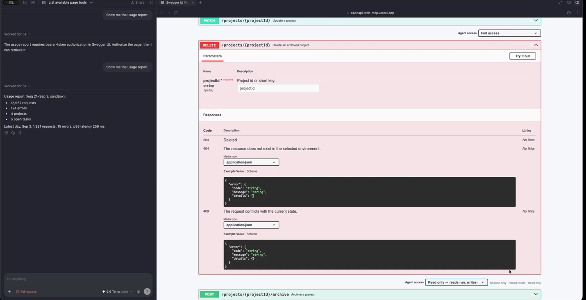
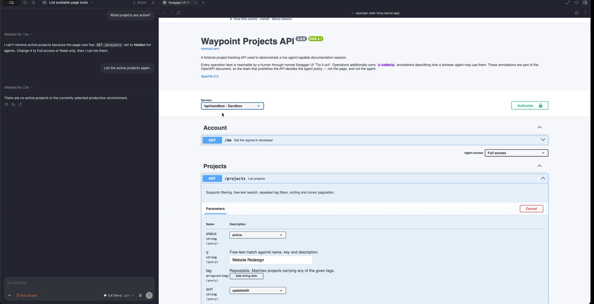
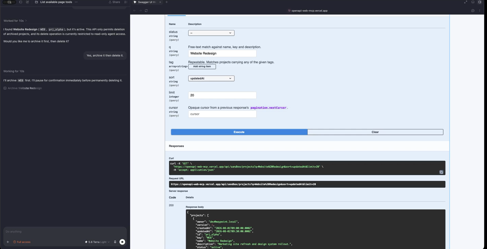

<div class="home-section">

## Try it now

<p class="sub">This is the deployed demo, a stateful Waypoint project-tracker API with Sandbox and Production data stores. No sign-in needed. Agent tools appear only in a browser that implements WebMCP; everything else works for humans either way.</p>

<div class="demo-frame">
<iframe src="https://openapi-web-mcp.vercel.app" title="Swagger UI WebMCP live demo" loading="lazy"></iframe>
</div>
<p class="demo-note">Prefer a full tab? <a href="https://openapi-web-mcp.vercel.app" target="_blank" rel="noopener">Open the demo</a>. The <a href="/openapi-web-mcp/guide/demo">demo guide</a> has a prompt to paste into your agent.</p>

</div>

<div class="home-section">

## What it looks like

<div class="shots">
<figure><figcaption>Per-operation access control, set live next to Try it out.</figcaption></figure>
<figure><figcaption>Hidden operations do not exist for the agent, so it refuses.</figcaption></figure>
<figure><figcaption>The agent proposes and pauses; results land in Swagger's own panel.</figcaption></figure>
</div>

</div>

<div class="home-section">

## Install

```sh
npm install swagger-ui-webmcp
```

Published on npm as [`swagger-ui-webmcp`](https://www.npmjs.com/package/swagger-ui-webmcp). Peers: `swagger-ui >=5.32.0 <5.34.0` and `react >=18 <20`. Add it as a Swagger UI plugin:

```ts
import SwaggerUI from "swagger-ui";
import SwaggerUIWebMCP from "swagger-ui-webmcp";
import "swagger-ui/dist/swagger-ui.css";

SwaggerUI({
  dom_id: "#swagger-ui",
  url: "/openapi.yaml",
  plugins: [SwaggerUIWebMCP],
  webMcp: { exposure: "write" },
});
```

The plugin registers tools on `document.modelContext` when the browser provides it, and registers none when it does not. See [Getting started](/guide/getting-started) for the full walkthrough.

</div>

<div class="home-section">

## What you get

<div class="feature-grid">
<div><h3>The docs page is the integration</h3><p>Tools are derived from the loaded OpenAPI document and run through Swagger UI's own <code>specActions.execute</code>, so login, selected server and interceptors are inherited.</p></div>
<div><h3>Four parties, one lattice</h3><p>API publisher (<code>x-webmcp</code>), page owner, the person at the page, and the WebMCP client each narrow access. Levels are <code>hidden &lt; read &lt; write</code>; the tightest wins.</p></div>
<div><h3>Live per-operation locks</h3><p>A dropdown next to Try it out sets Full access, Read only or Hidden for this tab. It resets on reload, and no tool input can change it.</p></div>
<div><h3>Untrusted specs stay untrusted</h3><p>A spec can hide or hold operations at read, but cannot talk a read-only page into writes. Malformed annotations are dropped, not guessed at.</p></div>
<div><h3>Same panel for agent and human</h3><p>Agent calls render in Swagger's normal response panels, so you can compare what the agent sent with what you would have sent.</p></div>
<div><h3>Agent-attributed audit hint</h3><p>The exported <code>agentExecution</code> lets a page's request interceptor tag agent traffic. It is a hint, not an identity proof.</p></div>
</div>

</div>

<div class="home-section">

## Docs

<p class="sub">Start with <a href="/openapi-web-mcp/guide/getting-started">Getting started</a>, then read <a href="/openapi-web-mcp/guide/policy">who decides what an agent may touch</a>, the <a href="/openapi-web-mcp/guide/x-webmcp">x-webmcp extension</a>, <a href="/openapi-web-mcp/guide/security">security and limitations</a>, and the <a href="/openapi-web-mcp/webmcp-tools">tool reference</a>. Source is on <a href="https://github.com/alliecatowo/openapi-web-mcp">GitHub</a> (Apache-2.0).</p>

</div>
